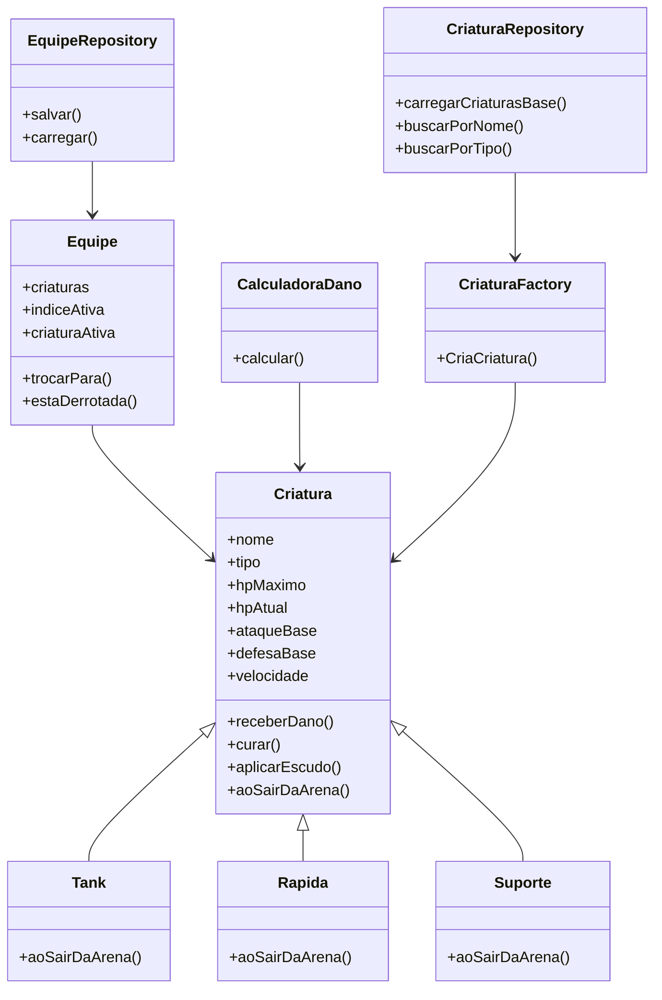
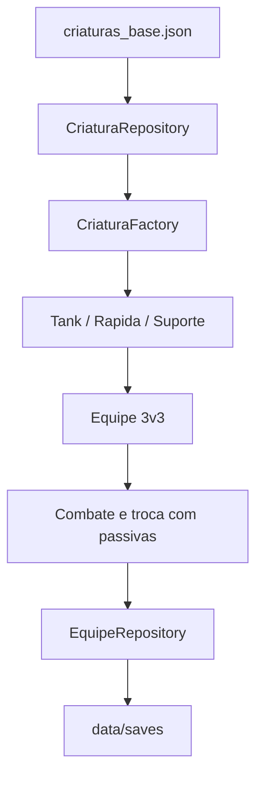

# naturaMon

Projeto desenvolvido para a disciplina de Programação Orientada a Objetos.

O **naturaMon** é um sistema de combate 3v3 em turnos, inspirado em jogos de criaturas elementais. O objetivo do projeto é demonstrar o uso de conceitos de POO por meio de regras de negócio, testes automatizados, persistência em arquivos e uma demo executável no terminal.

---

## Como rodar o projeto

### Instalar dependências

```bash
npm install
```

### Rodar os testes

```bash
npm test
```

### Rodar a demo

```bash
npm run demo
```

A demo executa uma simulação no terminal mostrando carregamento de criaturas, criação de equipes, ataque elemental, troca com passivas, condição de vitória e salvamento do estado da equipe.

---

## Ideia geral do sistema

O sistema simula uma batalha entre duas equipes de criaturas.

Cada equipe possui:

* 3 criaturas no total;
* 1 criatura ativa na arena;
* 2 criaturas no banco de reservas.

A partida não termina quando apenas a criatura ativa é derrotada. Uma equipe só perde quando todas as suas 3 criaturas chegam a 0 de HP.

---

## Regras de negócio

### Combate 3v3

Cada equipe possui exatamente 3 criaturas.

A primeira criatura da equipe começa como ativa, enquanto as outras ficam no banco.

```txt
Equipe
├── Criatura ativa
├── Reserva 1
└── Reserva 2
```

A equipe só é considerada derrotada quando todas as criaturas estiverem com HP igual a 0.

---

### Tipos elementais

O sistema possui criaturas e habilidades elementais.

Tipos principais:

* Água
* Fogo
* Terra
* Normal

As vantagens elementais seguem a regra:

```txt
Água causa 2x de dano em Fogo
Fogo causa 2x de dano em Terra
Terra causa 2x de dano em Água
```

Ataques contra elementos resistentes causam dano reduzido.

---

### Arquétipos

As criaturas possuem arquétipos. Cada arquétipo é uma especialização da classe `Criatura`.

```txt
Criatura
├── Tank
├── Rapida
└── Suporte
```

Cada arquétipo possui uma passiva própria ativada quando sai da arena durante uma troca.

#### Suporte

Ao sair da arena, cura a criatura que está entrando.

```txt
Suporte sai → criatura que entra recebe cura
```

#### Rápida

Ao sair da arena, causa um ataque físico instantâneo no adversário antes de concluir a troca.

```txt
Rápida sai → adversário recebe dano
```

#### Tank

Ao sair da arena, aplica escudo na criatura que está entrando.

```txt
Tank sai → criatura que entra recebe escudo
```

O escudo bloqueia o próximo dano recebido e depois é consumido.

---

### Troca de criaturas

A troca consome o turno e ativa a passiva da criatura que está saindo.

Fluxo da troca:

```txt
1. Verifica se a troca é válida
2. Identifica a criatura que está saindo
3. Identifica a criatura que está entrando
4. Executa aoSairDaArena()
5. Atualiza a criatura ativa
```

A equipe não precisa saber se a criatura que está saindo é Tank, Rápida ou Suporte. Ela apenas chama o método `aoSairDaArena()`, e o comportamento correto acontece por polimorfismo.

---

## Persistência

As criaturas base do jogo ficam armazenadas em:

```txt
data/criaturas_base.json
```

O sistema não cria todas as criaturas diretamente no código da batalha. Em vez disso, o fluxo é:

```txt
criaturas_base.json
↓
CriaturaRepository
↓
CriaturaFactory
↓
Tank / Rapida / Suporte
```

O estado das equipes pode ser salvo em arquivos dentro de:

```txt
data/saves/
```

A pasta `data/saves/` é ignorada pelo Git, pois contém arquivos gerados durante a execução da demo.

---

## Estrutura do projeto

```txt
naturaMon/
├── data/
│   ├── criaturas_base.json
│   └── saves/
│
├── src/
│   ├── arquetipos/
│   │   ├── Rapida.ts
│   │   ├── Suporte.ts
│   │   └── Tank.ts
│   │
│   ├── Factories/
│   │   └── CriaturaFactory.ts
│   │
│   ├── repositories/
│   │   ├── CriaturaRepository.ts
│   │   └── EquipeRepository.ts
│   │
│   ├── CalculadoraDano.ts
│   ├── Criatura.ts
│   ├── Equipe.ts
│   ├── Habilidade.ts
│   └── demo.ts
│
├── tests/
│   ├── Arquetipos.spec.ts
│   ├── CalculadoraDano.spec.ts
│   ├── Criatura.spec.ts
│   ├── CriaturaFactory.spec.ts
│   ├── CriaturaRepository.spec.ts
│   ├── Equipe.spec.ts
│   ├── EquipeRepository.spec.ts
│   └── Troca.spec.ts
│
├── package.json
├── tsconfig.json
├── jest.config.js
└── README.md
```

---

## Principais classes

### `Criatura`

Classe base do sistema.

Responsável por controlar:

* nome;
* tipo elemental;
* HP máximo;
* HP atual;
* ataque;
* defesa;
* velocidade;
* habilidades;
* dano recebido;
* cura;
* escudo;
* comportamento ao sair da arena.

---

### `Tank`, `Rapida` e `Suporte`

Subclasses de `Criatura`.

Cada uma sobrescreve o método:

```ts
aoSairDaArena(criaturaEntrando, criaturaAdversaria)
```

Isso permite que cada arquétipo tenha um comportamento próprio durante a troca.

---

### `Equipe`

Representa uma equipe 3v3.

Responsável por:

* armazenar as 3 criaturas;
* controlar qual criatura está ativa;
* validar trocas;
* executar a passiva da criatura que sai;
* verificar se a equipe foi derrotada.

---

### `CalculadoraDano`

Responsável por calcular o dano considerando:

* ataque da criatura;
* poder da habilidade;
* defesa do alvo;
* vantagem ou resistência elemental.

---

### `CriaturaFactory`

Responsável por criar objetos do tipo correto a partir dos dados do JSON.

Exemplo:

```txt
"TANK"    → new Tank(...)
"RAPIDA"  → new Rapida(...)
"SUPORTE" → new Suporte(...)
```

---

### `CriaturaRepository`

Responsável por carregar as criaturas base do arquivo `criaturas_base.json` e retorná-las como objetos do sistema.

---

### `EquipeRepository`

Responsável por salvar e carregar o estado de uma equipe, incluindo HP atual, escudo e criatura ativa.

---

## Conceitos de POO utilizados

### Encapsulamento

A classe `Criatura` centraliza comportamentos relacionados ao estado interno da criatura, como:

* receber dano;
* curar;
* aplicar escudo;
* controlar HP atual.

---

### Herança

Os arquétipos são subclasses da classe `Criatura`.

```txt
Tank extends Criatura
Rapida extends Criatura
Suporte extends Criatura
```

---

### Polimorfismo

A classe `Equipe` chama o mesmo método para qualquer criatura:

```ts
criaturaSaindo.aoSairDaArena(criaturaEntrando, criaturaAdversaria);
```

Mas o comportamento muda de acordo com a classe real do objeto:

```txt
Suporte → cura
Rapida  → ataca
Tank    → aplica escudo
```

Esse é um dos principais pontos de POO do projeto.

---

### Factory

A `CriaturaFactory` centraliza a lógica de criação das criaturas.

Isso evita que o restante do sistema precise saber diretamente como instanciar cada arquétipo.

---

### Repository

Os repositories separam a lógica de persistência da lógica de batalha.

Assim, as classes de domínio não precisam lidar diretamente com leitura e escrita de arquivos.

---

## Diagramas

### Diagrama simplificado de classes



---

### Fluxo de criação e batalha



---

## Testes automatizados

O projeto utiliza Jest para testar as principais regras de negócio.

Principais grupos de testes:

```txt
Criatura.spec.ts
CalculadoraDano.spec.ts
Arquetipos.spec.ts
Equipe.spec.ts
Troca.spec.ts
CriaturaFactory.spec.ts
CriaturaRepository.spec.ts
EquipeRepository.spec.ts
```

Os testes cobrem:

* recebimento de dano;
* limite de HP;
* habilidades;
* cálculo de dano elemental;
* arquétipos;
* passivas;
* troca de criaturas;
* condição de vitória;
* criação de criaturas pela Factory;
* carregamento pelo Repository;
* salvamento de equipe.

---

## Demo

A demo pode ser executada com:

```bash
npm run demo
```

Ela demonstra:

```txt
1. Carregamento das criaturas do JSON
2. Criação de duas equipes
3. Ataque com vantagem elemental
4. Troca com passiva de Suporte
5. Troca com passiva de Rápida
6. Troca com passiva de Tank
7. Condição de vitória
8. Salvamento do estado da equipe
```

---

## Autores

Projeto desenvolvido em dupla para a disciplina de Programação Orientada a Objetos.

* Wallace dos Santos Pereira — RA: 148567
* Lucas Vinicius Gonçalves — RA: 163924

